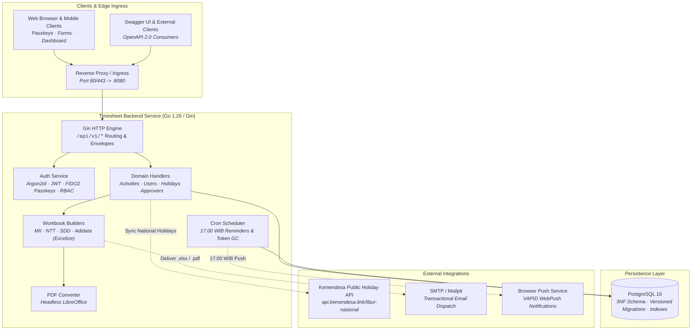

<div align="center">

# Timesheet Backend

High-performance, multi-company timesheet generation engine and RESTful API built with Go (Gin Web Framework) and PostgreSQL.

[](https://go.dev/)
[](https://github.com/Waluh-Corporation/timesheet-backend/actions/workflows/ci.yml)
[](https://sonarcloud.io/summary/new_code?id=Waluh-Corporation_timesheet-generator)
[](CHANGELOG.md)

</div>

---

Timesheet Backend automates monthly corporate timesheet generation across multi-vendor formats (such as MII, NTT, SDD, and Adidata). It eliminates manual monthly spreadsheet consolidation by programmatically producing formula-driven Excel workbooks and landscape PDF exports, managing daily work activities, providing dual authentication with FIDO2 WebAuthn passkeys and Argon2id password hashing, dispatching daily Web Push notifications, and automatically synchronizing Indonesian national holidays.

## Key Features

### Multi-Company Spreadsheet Generation
- **Programmatic Excel Builders**: Generates company-specific timesheets ([`services/builder_*.go`](services/)) with strict cell styling, company logos, day-fraction duration calculations, and automatic month-length trimming (28-31 days).
- **Dynamic Formula Rewriting & Signature Alignment**: Aligns formulas and multi-tier approver signature blocks based on working days and company requirements.
- **Automated Landscape PDF Export**: Converts generated spreadsheets into landscape PDFs using headless LibreOffice.

### Authentication & Security
- **Dual Authentication**: Modern Argon2id password hashing adhering to OWASP guidelines, coupled with FIDO2 / WebAuthn passkey assertion (`go-webauthn/webauthn`).
- **Role-Based Access Control (RBAC)**: JWT authentication with strict `admin` and `user` authorization boundaries.
- **NIST SP 800-63B Password Policy**: Enforces password length, dictionary checks, and safe bootstrapping.
- **Strict Data Ownership & IDOR Protection**: Parameterized route queries and ownership guards ensure users can only view and mutate their own activity records.

### PostgreSQL & 3NF Relational Integrity
- **Third Normal Form (3NF)**: Fully normalized schema separating `companies`, `departments`, `projects`, `approvers`, `activity_statuses`, `holidays`, and `daily_activities`.
- **Domain Constraints**: Database-level `CHECK` constraints on user roles, approver role types, PCR status, and activity time formats (`HH:MM`).
- **Embedded SQL Migrations**: Versioned up/down SQL migrations executed automatically on startup via Go `embed` ([`database/migrations/`](database/migrations/)).

### Background Services & Integrations
- **Web Push Reminders (VAPID)**: Daily cron task running at 17:00 WIB (`Asia/Jakarta`) to notify active users with unsubmitted daily entries.
- **Kemendesa Public Holiday API**: Automated synchronization with `api.kemendesa.link/libur-nasional` with civic, religious, and joint leave classifications and yearly bulk caching.
- **Transactional SMTP Delivery**: Asynchronous delivery of generated timesheets, onboarding invitations, and password reset links via gomail (Mailpit supported for development).

---

## Technology Stack

| Layer | Technology | Purpose |
| :--- | :--- | :--- |
| **Language & Runtime** | Go 1.25+ / 1.26 | Primary backend runtime |
| **HTTP Framework** | Gin Gonic (`github.com/gin-gonic/gin`) | High-throughput HTTP router & middleware |
| **Database & ORM** | PostgreSQL 16 & GORM (`gorm.io/gorm`) | Relational persistence with `pgx` driver |
| **Spreadsheet Engine** | Excelize v2 (`github.com/xuri/excelize/v2`) | Programmatic workbook rendering |
| **Authentication** | `golang-jwt/jwt/v5` & `go-webauthn/webauthn` | JWT sessions and FIDO2 passkeys |
| **Background Cron** | `robfig/cron/v3` | Scheduled 17:00 WIB reminders & token cleanup |
| **Documentation** | Swag (OpenAPI 2.0 / Swagger UI) | Interactive API contract and documentation |
| **Containerization** | Docker & Docker Compose | Containerized local and production runtime |

---

## Repository Structure

```
├── assets/                 # Corporate logos and spreadsheet master templates
├── auth/                   # JWT generation, Argon2id hashing, and WebAuthn passkey handlers
├── cmd/                    # Administrative CLI commands and utilities
├── config/                 # Environment variables and application runtime configuration
├── database/               # Database connection setup, migrator, and seeds
│   └── migrations/         # Versioned up/down SQL migration scripts
├── docs/                   # Swagger specs, database guides, and architecture artifacts
├── handlers/               # Gin route controllers, middleware, and request/response DTOs
├── mailer/                 # Transactional SMTP email delivery engine
├── models/                 # GORM database entities and data transfer objects
├── push/                   # WebPush VAPID notification dispatch service
├── scheduler/              # Cron background jobs (reminders and token housekeeping)
├── services/               # Company Excel builders, PDF conversion, and holiday sync
├── Dockerfile              # Multi-stage hardened production Docker build
├── docker-compose.yml      # Local development stack (PostgreSQL, Mailpit, Backend)
├── main.go                 # Application entry point
└── CHANGELOG.md            # Documented project release history
```

---

## Getting Started

### Prerequisites
- [Go 1.25+](https://go.dev/dl/) installed locally
- [Docker](https://www.docker.com/) and [Docker Compose](https://docs.docker.com/compose/)

### Option 1: Running with Docker Compose (Recommended)

Launch the full service topology (PostgreSQL, Mailpit SMTP, and the Go backend service):

```bash
docker compose up --build
```

Access the development services:
- **Backend API**: `http://localhost:8080`
- **Swagger Documentation**: `http://localhost:8080/swagger/index.html`
- **Mailpit Web UI**: `http://localhost:8025`
- **PostgreSQL**: `localhost:5432` (`postgres` / `postgres`)

### Option 2: Running Locally with Go

1. **Configure Environment**:
   ```bash
   cp .env.example .env
   # Update DB_HOST, DB_USER, DB_PASSWORD, and SMTP settings in .env
   ```

2. **Execute Database Migrations**:
   ```bash
   go run main.go -migrate
   ```

3. **Start the Application**:
   ```bash
   go run main.go
   ```

> [!TIP]
> For live hot-reloading during development, install [Air](https://github.com/air-verse/air) and start the server using:
> ```bash
> air -c .air.toml
> ```

---

## API Reference & Documentation

Interactive Swagger documentation is served directly by the backend at:
- **Swagger UI**: `http://localhost:8080/swagger/index.html`
- **OpenAPI 2.0 JSON**: `http://localhost:8080/swagger/doc.json`

> [!NOTE]
> All endpoints are versioned with the `/api/v1` route prefix. Standard responses follow the unified envelope format:
> ```json
> {
>   "code": 200,
>   "status": "success",
>   "data": { ... }
> }
> ```

### Key Endpoints

| Group | Method & Path | Access | Description |
| :--- | :--- | :--- | :--- |
| **System** | `GET /api/v1/setup/status` | Public | Check if one-time onboarding is required |
| **System** | `POST /api/v1/setup/init` | Public | Initial admin account and master data setup |
| **Auth** | `POST /api/v1/auth/login` | Public | Password authentication (Argon2id) |
| **Auth** | `POST /api/v1/auth/passkey/login/begin` | Public | Initiate FIDO2 passkey challenge |
| **Auth** | `POST /api/v1/auth/passkey/login/finish` | Public | Complete WebAuthn assertion |
| **Activities**| `POST /api/v1/activities` | User | Upsert daily timesheet entry |
| **Activities**| `GET /api/v1/activities` | User | List user activities with pagination & date filters |
| **Activities**| `GET /api/v1/activities/:id` | User | View single daily activity details (IDOR protected) |
| **Timesheet** | `POST /api/v1/timesheet/generate` | User | Generate company Excel timesheet & email attachment |
| **Holidays**  | `GET /api/v1/holidays` | User | Retrieve national holidays for calendar views |
| **Admin**     | `GET /api/v1/admin/users` | Admin | List and manage platform user accounts |
| **Admin**     | `GET /api/v1/admin/profile-changes` | Admin | Review pending profile update requests |

---

## Testing & Quality Assurance

Run the test suite across all packages:

```bash
go test -v -race -cover ./...
```

Run static analysis and linter validation:

```bash
golangci-lint run
```

> [!IMPORTANT]
> CI workflows enforce strict quality gates on pull requests, including `govulncheck` vulnerability scans, `golangci-lint`, race condition detection, and SonarQube quality gates (requiring $\ge 80\%$ test coverage on new code and 0 duplicated code density).

---

## Architecture & System Design

The Timesheet Backend is engineered around a clean layered architecture with clear separation between HTTP routing, business logic, persistence, and external service adapters.

An interactive, multi-view visualization is available in [`docs/architecture.html`](docs/architecture.html).

### System Component Architecture



### Architectural Highlights
1. **Ingress & Security Boundary**: All inbound traffic terminates at the reverse proxy and enters the Gin router. Authentication middleware strictly enforces Bearer JWT tokens or manages WebAuthn ceremony sessions before requests reach domain handlers.
2. **Business Engine & Builders**: Spreadsheet builders operate independently through clean domain interfaces. Each company builder (`MII`, `NTT`, `SDD`, `Adidata`) encapsulates company-specific cell coordinates, styling palettes, formula translations, and duration calculations without cross-polluting database schemas.
3. **Data Integrity**: Persistence relies on pure 3NF normalization. Foreign key relationships and domain `CHECK` constraints prevent invalid state transitions, while composite indexes optimize high-volume queries by user and date.
4. **Resilient Background Processing**: The background scheduler operates asynchronously on a dedicated Jakarta timezone clock (`Asia/Jakarta`), performing non-blocking daily timesheet submission checks and executing automatic token garbage collection.
